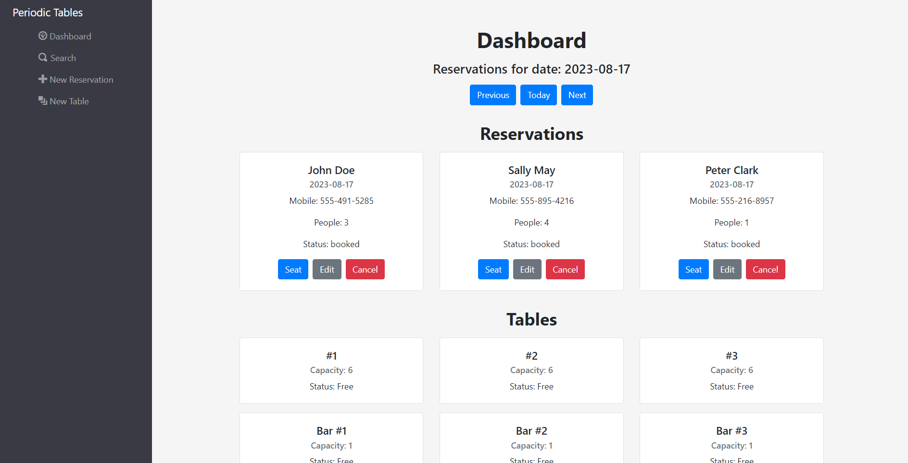

# Restaurant Reservation System

[View it live here](https://restaurant-reservation-wx3v.onrender.com/dashboard)



## About

The Restaurant Reservation System is a full-stack application crafted to streamline the reservation management process for restaurants. This application empowers restaurant managers to effectively manage table reservations, ensuring an organized and delightful dining experience for guests.

## Features

1. **Dynamic Reservations:** Easily create, modify, and list reservations to keep track of daily guest visits.
2. **Intuitive Table Management:** Assign specific tables to reservations and monitor table availability in real-time.
3. **Search Capability:** Retrieve reservations instantly using phone numbers.
4. **Reservation Status:** Visualize the status of reservations (booked, seated, finished) for efficient management.
5. **Future Reservation Constraints:** Ensure reservations are made only on open days and during eligible hours.
6. **User-friendly Interface:** Navigate and manage reservations with a sleek, responsive, and intuitive UI.

## Tech Stack

- **Frontend:** React, JavaScript, Bootstrap
- **Backend:** Node.js, Express.js
- **Database:** PostgreSQL

## API Documentation

#### `GET /api/reservations`

**Description**: Fetches a list of all reservations.

**Response**:

```json
{
  "data": [
    {
      "reservation_id": 6,
      "first_name": "John",
      "last_name": "Doe",
      "mobile_number": "555-491-5285",
      "reservation_date": "2023-08-17T00:00:00.000Z",
      "reservation_time": "12:25:00",
      "people": 3,
      "created_at": "2023-08-17T16:26:09.060Z",
      "updated_at": "2023-08-17T16:26:09.060Z",
      "status": "seated"
    },
    {
      "reservation_id": 7,
      "first_name": "Sally",
      "last_name": "May",
      "mobile_number": "555-895-4216",
      "reservation_date": "2023-08-17T00:00:00.000Z",
      "reservation_time": "13:26:00",
      "people": 4,
      "created_at": "2023-08-17T16:26:58.324Z",
      "updated_at": "2023-08-17T16:26:58.324Z",
      "status": "booked"
    },
    {
      "reservation_id": 8,
      "first_name": "Peter",
      "last_name": "Clark",
      "mobile_number": "555-216-8957",
      "reservation_date": "2023-08-17T00:00:00.000Z",
      "reservation_time": "15:28:00",
      "people": 1,
      "created_at": "2023-08-17T16:28:23.241Z",
      "updated_at": "2023-08-17T16:28:23.241Z",
      "status": "booked"
    },
    {
      "reservation_id": 5,
      "first_name": "Anthony",
      "last_name": "Charboneau",
      "mobile_number": "620-646-8897",
      "reservation_date": "2026-12-30T00:00:00.000Z",
      "reservation_time": "18:00:00",
      "people": 2,
      "created_at": "2020-12-10T08:31:32.326Z",
      "updated_at": "2020-12-10T08:31:32.326Z",
      "status": "booked"
    },
    {
      "reservation_id": 3,
      "first_name": "Bird",
      "last_name": "Person",
      "mobile_number": "808-555-0141",
      "reservation_date": "2020-12-30T00:00:00.000Z",
      "reservation_time": "18:00:00",
      "people": 1,
      "created_at": "2020-12-10T08:31:32.326Z",
      "updated_at": "2020-12-10T08:31:32.326Z",
      "status": "booked"
    },
    {
      "reservation_id": 4,
      "first_name": "Tiger",
      "last_name": "Lion",
      "mobile_number": "808-555-0140",
      "reservation_date": "2025-12-30T00:00:00.000Z",
      "reservation_time": "18:00:00",
      "people": 3,
      "created_at": "2020-12-10T08:31:32.326Z",
      "updated_at": "2020-12-10T08:31:32.326Z",
      "status": "booked"
    },
    {
      "reservation_id": 1,
      "first_name": "Rick",
      "last_name": "Sanchez",
      "mobile_number": "202-555-0164",
      "reservation_date": "2020-12-31T00:00:00.000Z",
      "reservation_time": "20:00:00",
      "people": 6,
      "created_at": "2020-12-10T08:30:32.326Z",
      "updated_at": "2020-12-10T08:30:32.326Z",
      "status": "booked"
    },
    {
      "reservation_id": 2,
      "first_name": "Frank",
      "last_name": "Palicky",
      "mobile_number": "202-555-0153",
      "reservation_date": "2020-12-30T00:00:00.000Z",
      "reservation_time": "20:00:00",
      "people": 1,
      "created_at": "2020-12-10T08:31:32.326Z",
      "updated_at": "2020-12-10T08:31:32.326Z",
      "status": "booked"
    }
  ]
}
```

## Installation Instructions

### Clone the Repository

Clone and Fork the repository.

### Install then Run

Run npm install

Run npm start
